## Documentación de la aplicación con Google App Engine + PyDev + WebApp2 usando Eclipse ##

La aplicación consiste en mostrar el mensaje de "Hello world" en la web, usando GAE con Django y PyDev para programarlo en Python. Primero se requiere de numerosas instalaciones de diferentes dependencias.
Una vez instalados todos los módulos, plataformas y librerías necesarias, procedemos al desarrollo de la aplicación en Eclipse:

### Ejecución de la aplicación localmente para comprobar que funciona ###

**Figura 1**: Creamos el proyecto de tipo Python y Google App Engine.

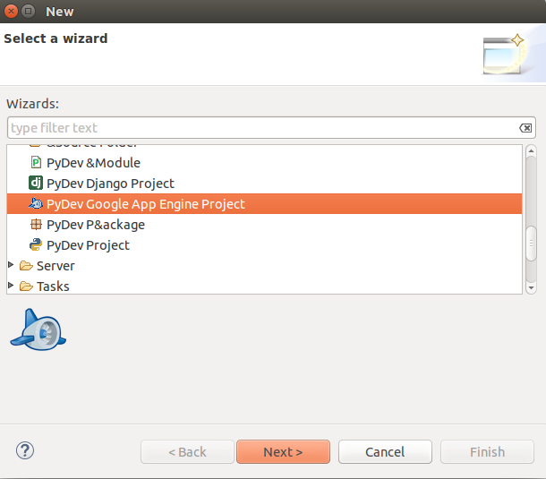

**Figura 2**: Ponemos un nombre al proyecto y modificamos la configuración del intérprete.

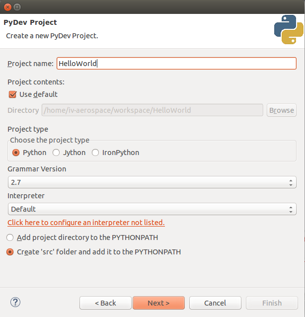

**Figura 3**: Añadimos la ruta donde se encuentra Google App Engine instalado.

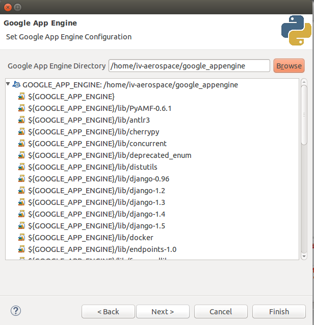

**Figura 4**: Introducimos el nombre de nuestra aplicación. Y elegimos "Hello Webapp World" que es un template para generar los ficheros.

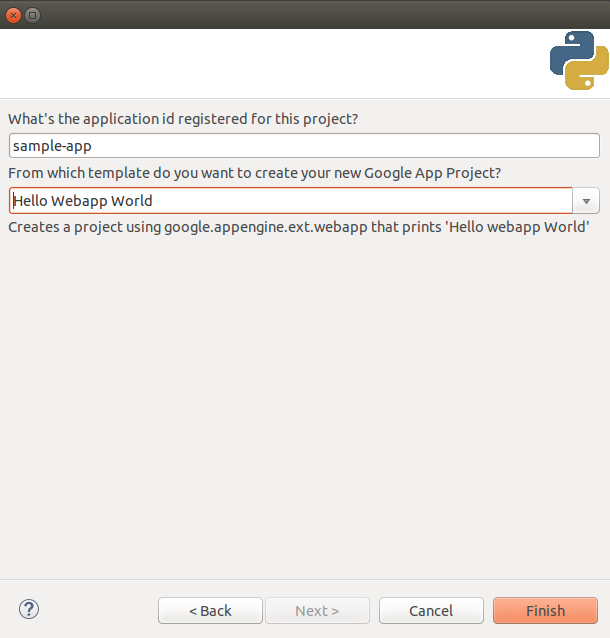 

**Figura 5**: Los archivos se han generado, entre ellos, el script de nuestra aplicación dentro del fichero HelloWorld.py.

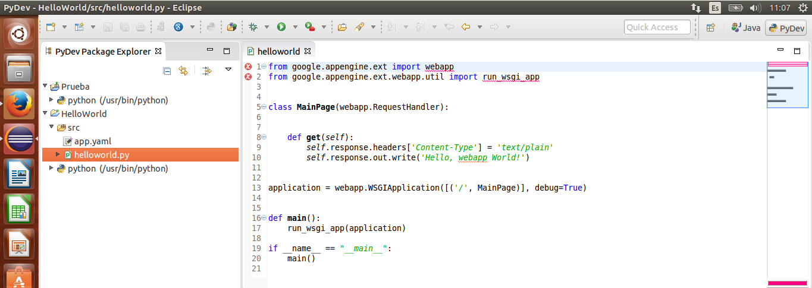 

**Figura 6**: Para ejecutarlo localmente, tenemos que hacer click derecho en helloworld.py, elegir "Run As" > "Run Configuration", y crear un nuevo "PyDev Google App Run" y añadimos de forma manual añadimos la ruta de "dev_appserver.py".

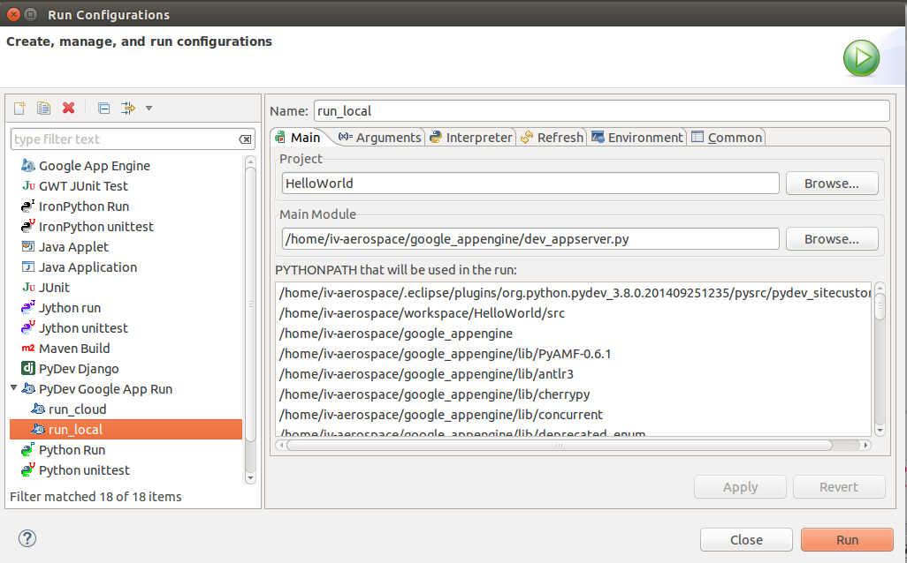

**Figure 7**: Posteriormente en "arguments" introducimos "${project_loc}/src" y ya podemos ejecutar nuestra aplicación correctamente.

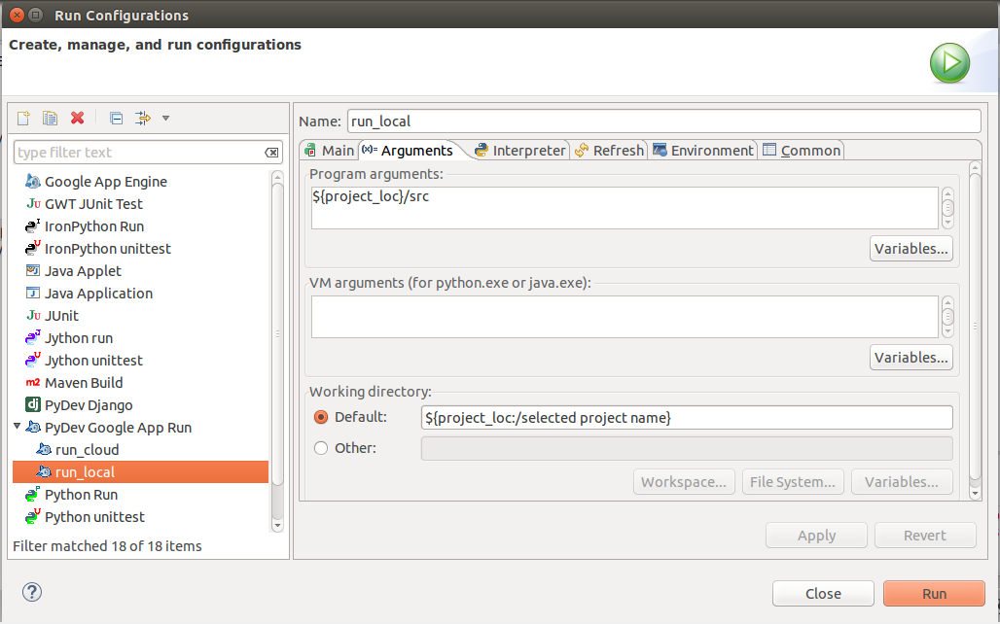

**Figure 8**: Nos vamos al navegador he introducimos "localhost:8080" y ya podemos ver nuestra aplicación correctamente desplegada localmente. 

 

Después de comprobar que la aplicación funciona perfectamente de forma local, procedemos a desplegarla en la nube:

### Ejecución de la aplicación en la nube (Deploy to Google App Engine) ###

**Figura 9**: Accedemos al archivo: app.yaml. Tendremos que modificar donde pone "sample-app" por el ID de la app para poder realizar el "deploy" de la aplicación correctamente en GAE. Posteriormente, volvemos a realizar el mismo paso que en la figura 6 pero esta vez añadiendo de forma manual la ruta de "appcfg.py".

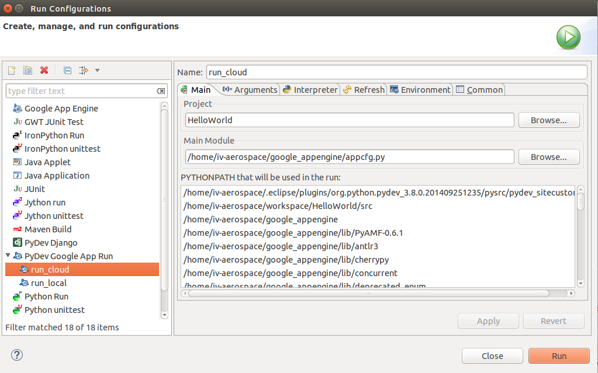 

**Figura 10**: Le pasamos el argumento **update ${project_loc}/src** para que actualice la app en los servidores de GAE.

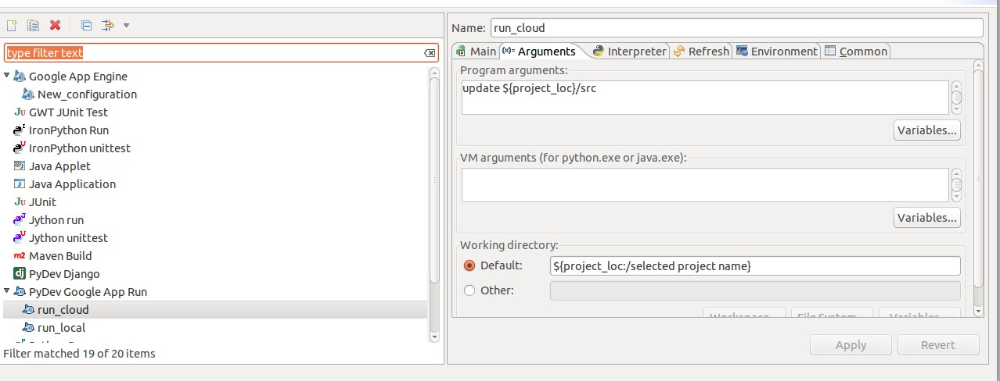

**Figura 11**: Debemos proporcionarle el correo de algún propietario de la app y una contraseña de aplicación cuyo enlace para obtenerla se muestra en esta imagen y los pasos que ha de seguir.

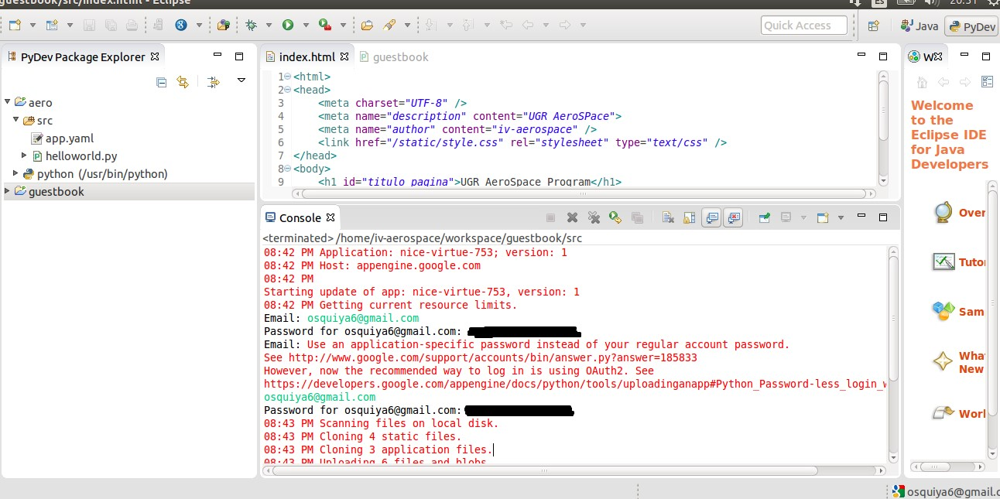

**Figura 12**: Datos desde GAE de nuestra aplicación, cuyo ID se ha introducido en el archivo app.yaml para que la aplicación se pueda desplegar en GAE.

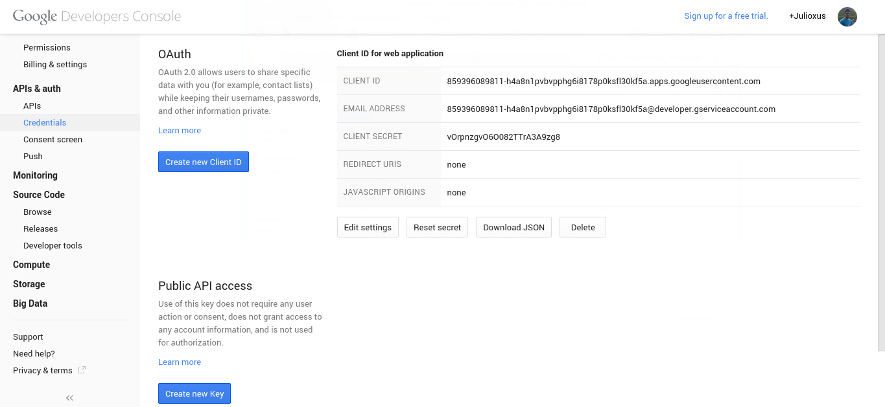

**Figura 13**: Finalmente, podemos comprobar como la aplicación ha sido desplegada con éxito y observar el resultado desde el navegador.
 
 
